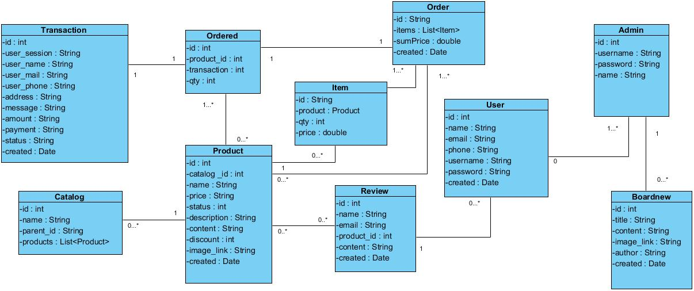

# Home Space Web Shop

Welcome to the Home Space Web Shop repository! This project is a comprehensive web application designed to provide a seamless shopping experience for home appliances.

## Project Link
You can access the project [here](https://github.com/davidchau21/Home-space-web-shop).

## Table of Contents

- [Introduction](#introduction)
- [Features](#features)
- [Technologies Used](#technologies-used)
- [Installation](#installation)
- [Usage](#usage)
- [Screenshots](#screenshots)
- [Class Diagram](#class-diagram)

## Introduction

Home Space Web Shop is an e-commerce platform that allows users to browse, search, and purchase a wide range of home appliances. The application provides a user-friendly interface and a secure, efficient shopping experience.

## Features

- **User Authentication**: Secure sign-up and login functionality.
- **Product Browsing**: Browse through various categories of home appliances.
- **Search Functionality**: Search for products by name or category.
- **Product Details**: View detailed information about each product.
- **Shopping Cart**: Add products to the cart and manage your selections.
- **Checkout Process**: Seamless checkout process with payment integration.
- **Order Management**: View and manage past orders.

## Technologies Used

- **Backend**: Java, Spring MVC
- **Frontend**: JSP (JavaServer Pages)
- **Database**: SQL Server
- **Build Tool**: Maven
- **Server**: Apache Tomcat

## Installation

To run this project locally, follow these steps:

1. **Clone the repository**
    ```bash
    git clone https://github.com/davidchau21/Home-space-web-shop.git
    ```

2. **Navigate to the project directory**
    ```bash
    cd Home-space-web-shop
    ```

3. **Build the project**
    ```bash
    mvn clean install
    ```

4. **Deploy the project on Apache Tomcat Server**
    - Download and install [Apache Tomcat](https://tomcat.apache.org/).
    - Copy the generated WAR file from the `target` directory to the `webapps` directory of your Tomcat installation.
    - Start the Tomcat server.

## Usage

After installation, you can access the application in your web browser at `http://localhost:8080/`. From there, you can sign up for a new account, browse products, add them to your cart, and proceed to checkout.

## Class Diagram

Below is the class diagram for the project:



## Screenshots

Here are some screenshots of the web application:

### Home Page


### Product Page


### Shopping Cart


### Detail Product


### Category 


### Login 


### Sign In


### Payment


### Admin Page


### Admin Home


### Admin Category


### Admin Product


